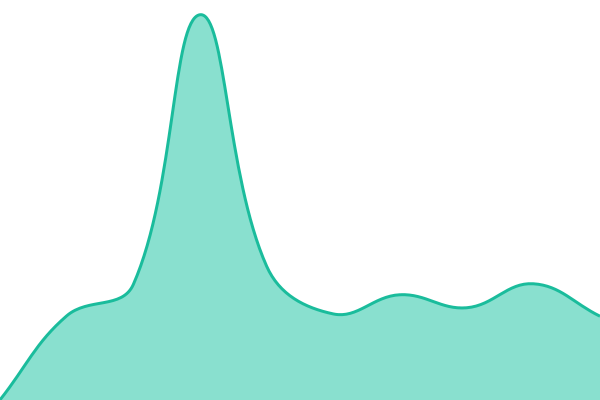
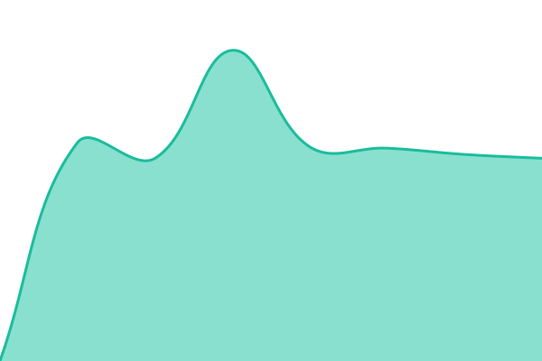

# [📈 Live Status](https://uptime.aonyx.fr): <!--live status--> **🟧 Partial outage**

This repository contains the open-source uptime monitor and status page for [Damien G](https://uptime.aonyx.fr), powered by [Upptime](https://github.com/upptime/upptime).

With [Upptime](https://upptime.js.org), you can get your own unlimited and free uptime monitor and status page, powered entirely by a GitHub repository. We use [Issues](https://github.com/feiuz/uptime-aonyx/issues) as incident reports, [Actions](https://github.com/feiuz/uptime-aonyx/actions) as uptime monitors, and [Pages](https://uptime.aonyx.fr) for the status page.

<!--start: status pages-->
<!-- This summary is generated by Upptime (https://github.com/upptime/upptime) -->
<!-- Do not edit this manually, your changes will be overwritten -->
<!-- prettier-ignore -->
| URL | Status | History | Response Time | Uptime |
| --- | ------ | ------- | ------------- | ------ |
|  [Aonyx Hosting (commercial)](https://aonyx.site) | 🟩 Up | [aonyx-hosting-commercial.yml](https://github.com/feiuz/uptime-aonyx/commits/HEAD/history/aonyx-hosting-commercial.yml) | 

 459ms
     
 | 

<a href="https://uptime.aonyx.fr/history/aonyx-hosting-commercial">100.00%</a>
    

|  [Aonyx (vitrine .fr)](https://aonyx.fr) | 🟩 Up | [aonyx-vitrine-fr.yml](https://github.com/feiuz/uptime-aonyx/commits/HEAD/history/aonyx-vitrine-fr.yml) | 

 454ms
     
 | 

<a href="https://uptime.aonyx.fr/history/aonyx-vitrine-fr">100.00%</a>
    

|  [Espace client](https://account.aonyx.site) | 🟩 Up | [espace-client.yml](https://github.com/feiuz/uptime-aonyx/commits/HEAD/history/espace-client.yml) | 

 876ms
     
 | 

<a href="https://uptime.aonyx.fr/history/espace-client">100.00%</a>
    

|  [SSO Authentik](https://auth.aonyx.site) | 🟩 Up | [sso-authentik.yml](https://github.com/feiuz/uptime-aonyx/commits/HEAD/history/sso-authentik.yml) | 

 1150ms
     
 | 

<a href="https://uptime.aonyx.fr/history/sso-authentik">100.00%</a>
    

|  [Control plane (manager)](https://manager.aonyx.site) | 🟥 Down | [control-plane-manager.yml](https://github.com/feiuz/uptime-aonyx/commits/HEAD/history/control-plane-manager.yml) | 

 0ms
     
 | 

<a href="https://uptime.aonyx.fr/history/control-plane-manager">0.00%</a>
    

|  [Edge · bastion Pi (.100)](https://health.aonyx.dev/) | 🟩 Up | [edge-bastion-pi-100.yml](https://github.com/feiuz/uptime-aonyx/commits/HEAD/history/edge-bastion-pi-100.yml) | 

 422ms
     
 | 

<a href="https://uptime.aonyx.fr/history/edge-bastion-pi-100">100.00%</a>
    

|  [Cluster · aonyx (.105)](https://health.aonyx.dev/?node=aonyx) | 🟥 Down | [cluster-aonyx-105.yml](https://github.com/feiuz/uptime-aonyx/commits/HEAD/history/cluster-aonyx-105.yml) | 

 2370ms
     
 | 

<a href="https://uptime.aonyx.fr/history/cluster-aonyx-105">0.00%</a>
    

|  [Cluster · minecraft-location (.5)](https://health.aonyx.dev/?node=minecraft-location) | 🟥 Down | [cluster-minecraft-location-5.yml](https://github.com/feiuz/uptime-aonyx/commits/HEAD/history/cluster-minecraft-location-5.yml) | 

 2375ms
     
 | 

<a href="https://uptime.aonyx.fr/history/cluster-minecraft-location-5">0.00%</a>
    

|  [Cluster · aonyx-sites (.205)](https://health.aonyx.dev/?node=aonyx-sites) | 🟥 Down | [cluster-aonyx-sites-205.yml](https://github.com/feiuz/uptime-aonyx/commits/HEAD/history/cluster-aonyx-sites-205.yml) | 

 2345ms
     
 | 

<a href="https://uptime.aonyx.fr/history/cluster-aonyx-sites-205">0.00%</a>
    

|  [Cluster · aonyx-sites-clstr2 (.206)](https://health.aonyx.dev/?node=aonyx-sites-clstr2) | 🟥 Down | [cluster-aonyx-sites-clstr2-206.yml](https://github.com/feiuz/uptime-aonyx/commits/HEAD/history/cluster-aonyx-sites-clstr2-206.yml) | 

 2358ms
     
 | 

<a href="https://uptime.aonyx.fr/history/cluster-aonyx-sites-clstr2-206">0.00%</a>
    

|  [Cluster · aonyx-sites-clstr3 (.207)](https://health.aonyx.dev/?node=aonyx-sites-clstr3) | 🟥 Down | [cluster-aonyx-sites-clstr3-207.yml](https://github.com/feiuz/uptime-aonyx/commits/HEAD/history/cluster-aonyx-sites-clstr3-207.yml) | 

 2348ms
     
 | 

<a href="https://uptime.aonyx.fr/history/cluster-aonyx-sites-clstr3-207">0.00%</a>
    

|  [Cluster · aonyx-sites-clstr4 (.208)](https://health.aonyx.dev/?node=aonyx-sites-clstr4) | 🟥 Down | [cluster-aonyx-sites-clstr4-208.yml](https://github.com/feiuz/uptime-aonyx/commits/HEAD/history/cluster-aonyx-sites-clstr4-208.yml) | 

 2354ms
     
 | 

<a href="https://uptime.aonyx.fr/history/cluster-aonyx-sites-clstr4-208">0.00%</a>
    

|  [Stockage · NAS Pi (.120)](https://health.aonyx.dev/?node=nas) | 🟥 Down | [stockage-nas-pi-120.yml](https://github.com/feiuz/uptime-aonyx/commits/HEAD/history/stockage-nas-pi-120.yml) | 

 2362ms
     
 | 

<a href="https://uptime.aonyx.fr/history/stockage-nas-pi-120">0.00%</a>
    

<!--end: status pages-->

[**Visit our status website →**](https://uptime.aonyx.fr)

## 📄 License

- Powered by: [Upptime](https://github.com/upptime/upptime)
- Code: [MIT](./LICENSE) © [Anand Chowdhary](https://anandchowdhary.com), supported by [Pabio](https://pabio.com)
- Data in the `./history` directory: [Open Database License](https://opendatacommons.org/licenses/odbl/1-0/)
